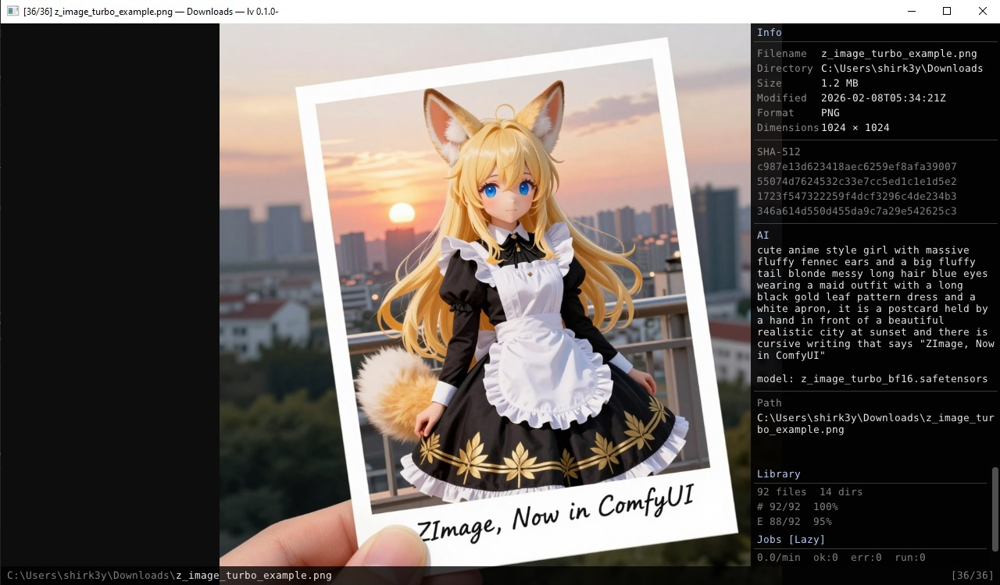

# lv

[](https://github.com/shirk33y/lv/actions/workflows/ci.yml)
[](https://github.com/shirk33y/lv/actions/workflows/release.yml)
[](https://github.com/shirk33y/lv/releases/latest)

Fast keyboard-driven media viewer. Single Rust binary, SQLite library database, GPU-rendered UI.



## Features

- **Image + video** playback via libmpv render API
- **Dear ImGui** overlay — file info, AI metadata, library stats
- **Keyboard-first** — j/k navigate, h/l switch dirs, y like, u random, n newest
- **Background workers** — SHA-512 hashing, EXIF extraction, AI prompt & settings parsing
- **File watcher** — live directory monitoring with notify
- **Drag & drop** — drop files or folders to browse instantly
- **CLI** — `track`, `untrack`, `watch`, `unwatch`, `scan`, `worker`

## Architecture

```
SDL2 (window + events)
  └─ OpenGL (glow)
       ├─ libmpv render API → texture
       ├─ image crate decode → GL texture (LRU preload cache)
       └─ imgui-rs overlay (status bar, metadata sidebar)
```

## Structure

```
src/
├── main.rs       # SDL2 event loop, GL context, imgui, keybinds
├── db.rs         # SQLite: files, meta, history, directories, jobs
├── scanner.rs    # recursive media discovery + rescan/prune
├── watcher.rs    # notify-based filesystem watcher
├── jobs.rs       # background worker pipeline (hash, exif, ai)
├── aimeta.rs     # AI metadata extraction (pnginfo, ComfyUI)
├── preload.rs    # LRU image preload cache
├── quad.rs       # fullscreen quad rendering
├── statusbar.rs  # imgui status bar + metadata panel
└── cli.rs        # CLI subcommands
```

## Build & run

```sh
cargo run --release           # GUI
cargo run -- track ~/Photos   # add directory
cargo run -- scan             # rescan all tracked dirs
cargo run -- worker           # headless hash/exif/ai worker
scripts/ci.sh                 # test + clippy + fmt
```

## Scripts

| Script | Description |
|--------|-------------|
| `scripts/ci.sh` | test + clippy + fmt (parallel) |
| `scripts/dev-linux.sh [args]` | debug build + run (Linux) |
| `scripts/dev-windows.sh [args]` | debug build + run (Windows/WSL) |
| `scripts/build-linux-intel.sh` | release build for x86_64 Linux |
| `scripts/build-linux-arm.sh` | release build for aarch64 Linux |
| `scripts/build-windows-intel.sh` | release build + NSIS installer for Windows |
| `scripts/docker-build.sh [target]` | dockerized cross-builds → `dist/` |
| `scripts/clean.sh` | remove build artifacts |

```sh
scripts/dev-linux.sh track ~/Photos
scripts/docker-build.sh linux-intel   # or: all
```

## Dependencies (Debian/Ubuntu)
```sh
sudo apt install build-essential ca-certificates curl pkg-config \
    libsdl2-dev libmpv-dev \
    gcc-aarch64-linux-gnu g++-aarch64-linux-gnu libc6-dev-arm64-cross \
    llvm clang nsis
```
