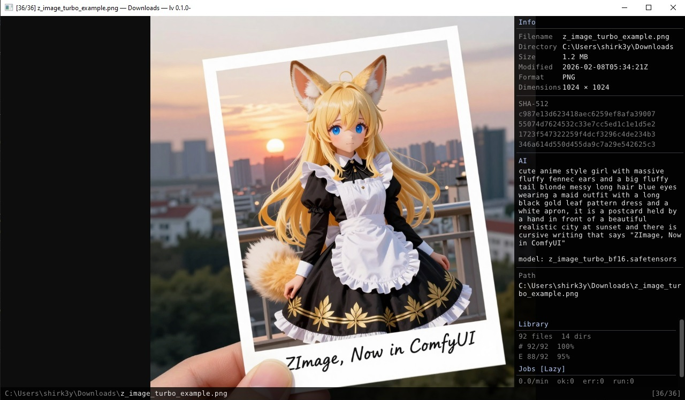

# lv

[](https://github.com/shirk33y/lv/actions/workflows/ci.yml)
[](https://github.com/shirk33y/lv/actions/workflows/release.yml)
[](https://github.com/shirk33y/lv/releases/latest)

Fast, keyboard-driven image and video library viewer. lv is a single Rust binary with an SQLite library database, background metadata indexing, live filesystem monitoring, and an SDL2/OpenGL UI.



## Features

- Image and video playback through native image decoding and libmpv
- Keyboard-first navigation across files, directories, favorites, and numbered collections
- Dear ImGui status bar and metadata sidebar
- SHA-512, EXIF, ffprobe, and AI-generation metadata indexing
- ComfyUI and Automatic1111 PNG prompt/model extraction
- Live directory monitoring plus startup rescan and deleted-file pruning
- Drag-and-drop opening for files and directories
- Automatic looping for videos shorter than 15 seconds; longer videos advance to the next media file
- CLI library management and filtered search by name, size, duration, resolution, and tag
- Linux Flatpak releases for x86_64 and aarch64

## Install

Download the Flatpak bundle for your CPU architecture from [GitHub Releases](https://github.com/shirk33y/lv/releases/latest):

```sh
flatpak install --user ./lv-X.Y.Z-x86_64.flatpak
flatpak run io.github.shirk33y.lv
```

Use the `aarch64` bundle on ARM64 Linux. For a system-wide installation:

```sh
flatpak install --system ./lv-X.Y.Z-x86_64.flatpak
flatpak run io.github.shirk33y.lv
```

System installation may request administrator approval through Flatpak/polkit.

### Access files outside HOME

The Flatpak can access files under `HOME` by default. Grant read-only access to a directory or mounted drive outside `HOME`:

```sh
flatpak override --user --filesystem=/path/to/media:ro io.github.shirk33y.lv
```

Restart lv after changing the override. Omit `:ro` if lv needs write access. Review or remove the override with:

```sh
flatpak override --user --show io.github.shirk33y.lv
flatpak override --user --nofilesystem=/path/to/media io.github.shirk33y.lv
```

## Quick start

Open a file or directory directly:

```sh
lv ~/Pictures
lv ~/Videos/example.mp4
```

Build a persistent library:

```sh
lv add ~/Pictures
lv watch ~/Pictures
lv sync
lv status
lv
```

`track`, `untrack`, and `scan` remain accepted aliases for `add`, `remove`, and `sync`.

## Keyboard controls

| Key | Action |
|---|---|
| `j` / `k` | Next / previous file; crosses directory boundaries |
| `h` / `l` | First file or previous directory / next directory |
| `u` | Random file |
| `n` | Newest file |
| `b` | Random favorite |
| `y` | Toggle favorite |
| `2`–`9` | Toggle numbered collection tag |
| `Shift+2`–`Shift+9` | Remove numbered collection tag |
| `Ctrl+0`–`Ctrl+9` | Toggle collection view |
| `i` | Toggle metadata sidebar |
| `Page Up` / `Page Down` | Scroll metadata sidebar |
| `f` | Toggle fullscreen |
| `c` | Copy current path |
| `r` | Refresh current directory and request a rescan |
| `-` | Toggle lazy/turbo metadata indexing |
| `Space` | Pause/resume video |
| `Left` / `Right` | Seek video -5s / +15s |
| `Up` / `Down` | Change video volume |
| `m` | Mute video |
| `v` | Toggle video loop |
| `q` / `Esc` | Quit |

Files and directories can also be dropped onto the window.

## CLI

```text
lv [PATHS]...
lv add PATH
lv remove PATH
lv watch PATH
lv unwatch PATH
lv sync [PATH]
lv sync --background
lv status
lv worker
lv get PATH [KEYS]...
lv set PATH KEY=VALUE...
lv find [OPTIONS] [PATTERN]
```

Search examples:

```sh
lv find '*.png'
lv find --size +10M --resolution 4k
lv find --duration +30s --tag like --sort random
lv find --resolution hd --count
lv find '*.mp4' --print0 | xargs -0 -r printf '%s\n'
```

Run `lv --help` or `lv <command> --help` for all options. Set `LV_DB_PATH` to use a custom database file.

## Build from source

Requirements:

- Rust stable
- SDL2 and libmpv development files
- OpenGL development files
- Linux, or Windows/WSL with the project cross-build tooling

Bazzite/Fedora development setup:

```sh
brew install sdl2 mpv xorgproto libx11 libxext libxrandr libxfixes
rustup toolchain install stable
rustup default stable
make configure
```

`make configure` detects native library prefixes and writes `.cargo/config.toml` for Cargo and rust-analyzer. Use `LV_NATIVE_PREFIXES=/custom/prefix1:/custom/prefix2 make configure` for non-Homebrew libraries.

Common development commands:

```sh
make check
make test
make dev
make dev ARGS=~/Pictures
make ci
```

Debian/Ubuntu native dependencies:

```sh
sudo apt install build-essential ca-certificates curl pkg-config \
    libsdl2-dev libmpv-dev
```

Generated caches and artifacts under `.flatpak-builder/`, `build/`, `dist/`, and `target/` are excluded from Cargo package fingerprinting.

## Packaging

### Flatpak

Containerized build and smoke test:

```sh
make flatpak-release
make flatpak-release FLATPAK_ARCH=aarch64
make flatpak-release CONTAINER_RUNTIME=docker
```

Lower-level container entry points:

```sh
./scripts/build-flatpak.sh --build-only
./scripts/build-flatpak.sh --install
./scripts/build-flatpak.sh --no-cache
./scripts/build-flatpak.sh --rebuild-image
```

Native build, used by GitHub Actions:

```sh
./scripts/build-flatpak-native.sh
```

Container builds require Podman or Docker. Native builds require Flatpak, flatpak-builder, OSTree, Python 3 with the generator dependencies, and jq. The manifest is `extra/flatpak/io.github.shirk33y.lv.json` and targets Freedesktop runtime 24.08.

Release CI builds x86_64 and aarch64 bundles, verifies checksums, runs CLI and video playback smoke tests, then uploads the Flatpaks to the GitHub Release.

### Other formats

```sh
scripts/build-linux-intel.sh
scripts/build-linux-arm.sh
scripts/build-windows-intel.sh
scripts/docker-build.sh all
```

These scripts produce local AppImage, Debian package, or Windows installer artifacts. Published GitHub releases currently contain Flatpak bundles.

## Architecture

```text
SDL2 window and events
└── OpenGL
    ├── libmpv render thread → shared video texture
    ├── image crate decode → LRU texture cache
    └── Dear ImGui → status bar and metadata sidebar

SQLite
├── tracked directories, files, history, tags, and collections
├── scanner and notify filesystem watcher
└── background hash, EXIF, ffprobe, and AI metadata jobs
```

## Source layout

```text
src/
├── main.rs       # CLI parsing, SDL2 event loop, rendering, keybindings
├── cli.rs        # library-management and search commands
├── db.rs         # SQLite schema and queries
├── scanner.rs    # recursive discovery and rescan/prune
├── watcher.rs    # live filesystem monitoring
├── jobs.rs       # background metadata pipeline
├── aimeta.rs     # ComfyUI and Automatic1111 PNG metadata
├── preload.rs    # image texture cache and preloading
├── quad.rs       # fullscreen OpenGL quad rendering
└── statusbar.rs  # status bar and metadata sidebar
```
